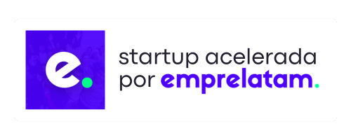

# 👋 Hi, I'm Andrés Cristancho

Let's connect: 

---

### Product Builder | Co-Founder

Co-Founder and co-developer of digital products, hands-on across architecture, automation, and AI integration. 

 – Building the AI OS for construction contractors in LATAM. Quote 10× faster, control every cent. Replaces Excel, Drive, and WhatsApp in one single platform.

>**facilia.app** is currently being accelerated by **Emprelatam (ECL 17)**.

 – Where creators launch the future of LATAM. Join the largest community of tech creators in Latin America!

 – B2B e-commerce for industrial services and supplies

---

## :zap: Recent Activity
<!--RECENT_ACTIVITY:start-->
1. ⭐ Starred [MoonshotAI/kimi-code](https://github.com/MoonshotAI/kimi-code) 
2. ⬆️ Pushed undefined commit(s) to [Facilia-AI/Facilia-AI](https://github.com/Facilia-AI/Facilia-AI) 
3. ⬆️ Pushed undefined commit(s) to [Facilia-AI/Facilia-AI](https://github.com/Facilia-AI/Facilia-AI) 
4. 💪 Opened PR [#2](undefined) in [Facilia-AI/Facilia-AI](https://github.com/Facilia-AI/Facilia-AI) 
5. ⬆️ Pushed undefined commit(s) to [Facilia-AI/Facilia-AI](https://github.com/Facilia-AI/Facilia-AI) 
<!--RECENT_ACTIVITY:end-->

**Last Updated:** <!--RECENT_ACTIVITY:last_update--><!--RECENT_ACTIVITY:last_update_end-->

## Engineering & Industrial Experience

Product support and warranty management, with failure analysis and advanced diagnostics across hydraulic systems, power train, diesel engines, electrical systems, and machine connectivity. I focus on machine health and performance monitoring through platforms such as Health Equipment Insights, VisionLink®, Cat® Foresight, and ACE Dataviewer, turning data intelligence powered by AI into actionable recommendations under a preventive and predictive approach — always driving safety-first, data-backed decisions.

### Project & Business Execution

Expert in end-to-end project execution: facilities enhancements and improvements, furniture manufacturing and installation, electrical and HVAC systems, and supplier and procurement management — delivering projects from planning to handover.

---

## ⚠️DISCLAIMER

I’m in constant learning mode and deliberately obsessed with acquiring new knowledge every day.  
Everything presented below represents **knowledge in construction**, ongoing experimentation, hands-on learning, and continuous iteration.
This profile reflects an evolving technical journey, not static expertise.

### Tech

I design and ship AI-powered products end to end — automating workflows, integrating models, and taking ideas from prototype to production. The stack below is what I build with.

    

### Focus

- LEARNING... knowledge in construction
- Testing tools
- Build real products, not demos  
